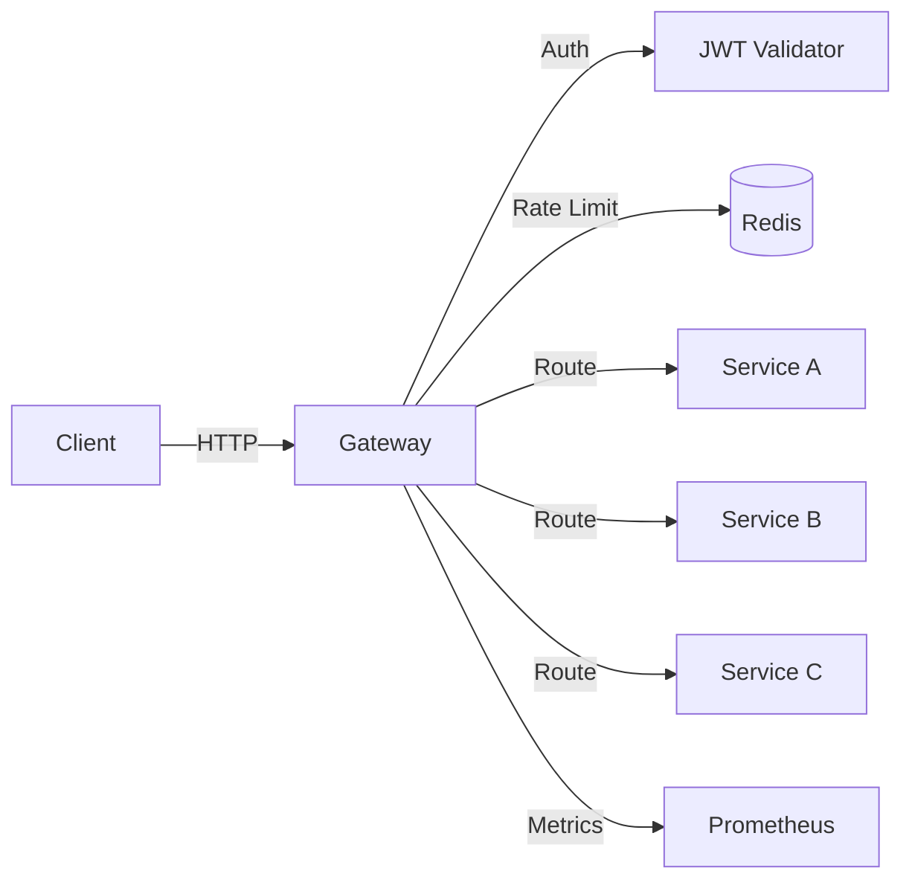
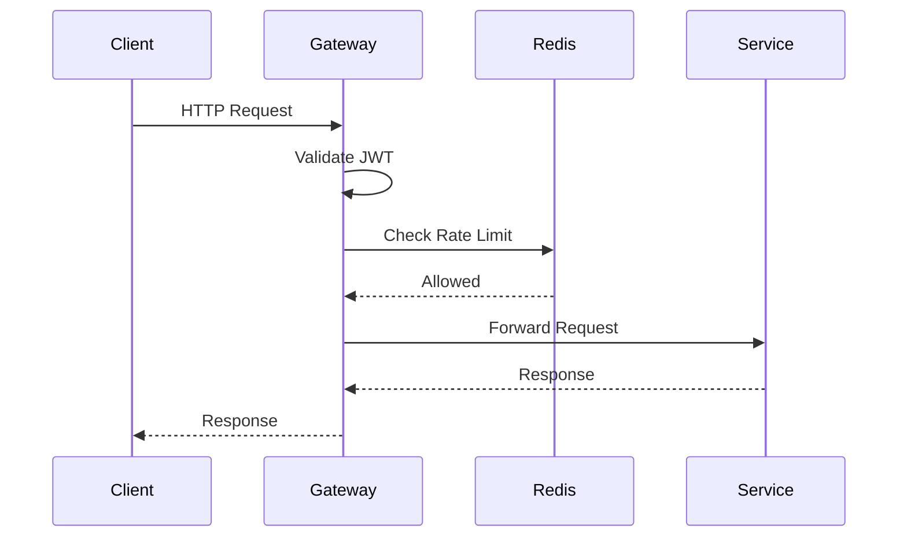

+++
draft = false
date = '2024-01-20'
title = 'API Gateway'
type = 'project'
description = 'A lightweight API gateway with rate limiting, JWT authentication, and request routing. Built for microservices architectures.'
repository = 'https://github.com/johndoe/api-gateway'
languages = ['Go']
tools = ['Redis', 'JWT', 'Docker', 'Prometheus']
+++

## Architecture

## Request Flow

